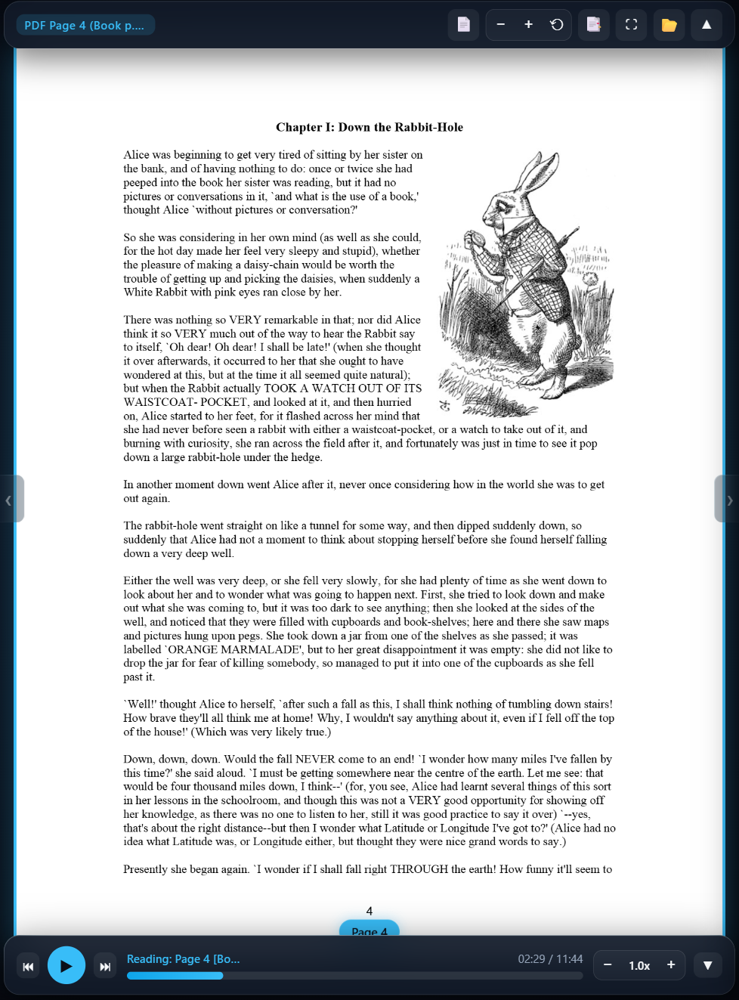

# Audio Any Books Agent

An AI agent skill that turns any PDF into an audiobook. Clone this repo, open it in an AI agent harness, then ask the agent to generate the voiceover for you (see the [example prompt](#3-prompt-the-agent)).

Once it's done, you'll get something like this: **[Live demo: Alice in Wonderland, Chapter 1](https://alice-chapter-1.zl25drexel.workers.dev/)**

<p align="center">
  
</p>

> Turn **ANY PDF book** into a presentation-quality, page-synchronized audiobook with natural spoken descriptions for code & diagrams, alongside an interactive dual-pane web reader.

**Zero manual commands required.** Just clone and prompt your AI agent!

---

## Quickstart: Let the AI Agent Do It All

You don't need to run extraction scripts, timing calculations, or audio synthesis commands yourself. An AI agent harness (such as **Google Antigravity**, **Claude Code**, **Cursor**, etc.) will handle the entire pipeline autonomously using the included agent skill.

### 1. Clone this repository
```bash
git clone https://github.com/jayl-dev/audio-any-books-agent.git
cd audio-any-books-agent
```

### 2. Open in your AI Agent Harness
Open this folder in **Google Antigravity** (or any agent environment that supports `.agents/skills/` or `SKILL.md`). The `pdf-book-voiceover` skill is automatically loaded into the agent's skillset.

### 3. Prompt the Agent:

> **"Use the voiceover skill to generate the files for chapter 1 of alice/alice-in-wonderland.pdf"**

*(You don't even need to run `npm install`—the agent checks dependencies and sets up the environment automatically!)*

---

### What the AI Agent Does Automatically

Once you give the prompt, the agent autonomously executes the full production workflow:

1. **Sets Up Environment**: Checks if `node_modules` is present and runs `npm install` automatically if any dependencies are missing.
2. **Discovers Page Boundaries**: Scans `alice/alice-in-wonderland.pdf` and identifies that Chapter 1 (*"Down the Rabbit-Hole"*) spans **PDF pages 4 to 7**.
3. **Prepares Spoken Script**: Reads narrative text verbatim, sanitizes mathematical/programming symbols, and inserts conversational descriptions for illustrations and diagrams (`Diagram description: ...`).
4. **Synthesizes Neural Audio**: Asks which engine you want. It recommends **Google Gemini 3.8 TTS** for studio-quality narration styled to the book; the free tier is usually enough for some personal use (its quota can be as low as 10 requests a day, about one per page), but you need a free API key from Google AI Studio. **Microsoft Edge voices** (default `en-US-AndrewMultilingualNeural`; also Ava, Emma, Brian, or British Sonia/Ryan) are free with no setup and no limits. Audio is generated page by page with automatic caching and retry on network hiccups.
5. **Computes Precise Markers**: Concatenates audio and calculates millisecond-accurate timestamps in **JSON**, **WebVTT** (`.vtt`), and **CSV**.
6. **Builds Interactive Dual-Pane Player**: Generates `alice_chapter_1_player.html` with synchronized page flips, drag-to-pan, and pinch-to-zoom (up to 3.8x).
7. **Prepares Offline Zero-CORS Data**: Generates the base64 preloader so you can double-click the HTML player directly from your desktop (`file:///`) without browser origin warnings.

---

## Generating Voiceovers for Any Other PDF Book

To generate voiceovers for any other book or chapter, simply drop your PDF file into the project and send a prompt:

> **"Use the voiceover skill to generate chapter 2 of my_book.pdf"**

Or specify exact pages and voice preferences:
> **"Use the voiceover skill to generate pages 50 to 75 of deep_learning.pdf using the en-US-AvaMultilingualNeural voice"**

Or use Google's Gemini 3.8 TTS for more expressive narration (needs a `GEMINI_API_KEY`):
> **"Use the voiceover skill with the Gemini engine and the Charon voice to generate chapter 1 of alice/alice-in-wonderland.pdf"**

---

## Interactive Player Features

- **Dual-Pane Spread**: Emulates a physical open book (two pages side-by-side on desktop landscape, single-pane on mobile portrait).
- **Drag-to-Pan & 3.8x Zoom**: Smooth freeform navigation with mouse drag or multi-touch pinch. Double-click or press `R` to reset.
- **Real-Time Auto Flipping**: Turns pages automatically in sync with the audio narration.
- **Current-Paragraph Highlight**: Highlights the paragraph being read right on the PDF page. Toggle it with the Highlight button or the `H` key.
- **Paused Manual Browsing with Auto-Resume Sync**: Freely flip through pages while paused; resuming audio instantly flips back and syncs to the spoken page.
- **Collapsible Markers Drawer**: Jump to any page or chapter instantly with the `M` key.

### Player Hotkeys

| Key | Action |
| :--- | :--- |
| `Space` | Play / Pause |
| `←` / `→` | Skip backward / forward 5 seconds |
| `[` / `]` or `PageUp` / `PageDown` | Flip previous / next page |
| `+` / `-` | Zoom in / out |
| `R` / Double-click | Reset zoom & pan to center |
| `M` | Toggle Markers Drawer |
| `H` | Toggle Paragraph Highlight |
| `F` | Toggle Fullscreen |

---

## Generated Deliverables

When the agent finishes, you will find these files **in the same folder as the source PDF** (e.g. `alice/`):

| File | Description |
| :--- | :--- |
| `<prefix>.mp3` | Master concatenated audiobook audio (24 kHz, 48 kbps mono MP3) |
| `<prefix>_player.html` | Interactive dual-pane synchronized web player |
| `<prefix>_markers.json` | Structured array of page-turn millisecond timestamps |
| `<prefix>_markers.vtt` | Standard WebVTT chapters / subtitle track |
| `<prefix>_markers.csv` | Spreadsheet format for synchronization tools |
| `<prefix>_paragraphs.json` | Per-paragraph timestamps, text, and the paragraph's position on the PDF page |
| `<prefix>_script.md` | Complete word-for-word narration transcript |
| `<slug>_pdf_data.js` | Base64 preloader for zero-CORS direct offline opening |

---

## Optional: Manual CLI Commands (Without Agent)

If you ever wish to run the pipeline manually via terminal commands:

```bash
# 1. Discover chapters
node scripts/discover_pages.js --pdf "alice/alice-in-wonderland.pdf" --query "Chapter I"

# 2. Generate voiceover and player
node scripts/generate_chapter_voiceover.js --pdf "alice/alice-in-wonderland.pdf" --pages 4-7 --title "Alice in Wonderland - Chapter 1" --prefix "alice_chapter_1"

# 3. Launch local streaming player
npm start
```

### Optional: Gemini 3.8 TTS engine

The default engine is Microsoft Edge TTS, which is free and needs no key. For more expressive, style-directed narration you can switch to Google's Gemini 3.8 TTS models:

```bash
# Get a key at https://aistudio.google.com/apikey, then either export it
# or put GEMINI_API_KEY=... in a .env file at the repo root (git-ignored)
export GEMINI_API_KEY=...
node scripts/generate_chapter_voiceover.js --pdf "alice/alice-in-wonderland.pdf" --pages 4-7 --prefix "alice_chapter_1" \
  --engine gemini --voice Achird --style "warm, playful storyteller reading aloud to a child"
```

- `--model` defaults to `gemini-3.8-flash-lite-tts` (about $0.54 per hour of audio). Use `gemini-3.8-flash-tts` for the higher-fidelity model (about $0.81 per hour). Google doubles both prices on January 1, 2027.
- Voices include Charon, Sadaltager, Sulafat, Gacrux, Achird, Kore, Puck and Aoede.
- Match `--style` and the voice to the kind of book, e.g. a storyteller for novels or a tech expert for programming books. When you use the agent, it picks these for you; see the table in SKILL.md.
- Scripts may include inline vocal tags such as `<sigh>` or `<short pause>` when using Gemini.
- Gemini audio carries Google's inaudible SynthID watermark.
- Prefer to pay through OpenRouter? Use `--engine openrouter` with `OPENROUTER_API_KEY` (from https://openrouter.ai/keys, or in `.env`). It runs the same Gemini 3.8 TTS models, voices and styles.

---

## License

MIT License. Free for personal and commercial use.
